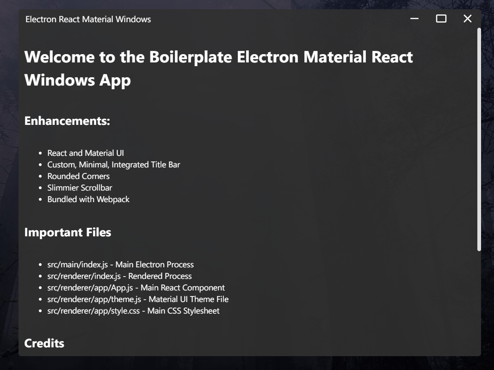

# Electron Windows Material UI

A minimal Electron Boilerplate with React and Material UI, designed for Windows 10.



## Getting Started

```bash
# install dependencies
npm install
```

### Building

```bash
# run application in development mode with hot reloading
yarn dev

# compile source code and create webpack output
yarn compile

# `yarn compile` & create distribution build with electron-builder
yarn dist

# `yarn compile` & create unpacked quick production test build
yarn dist:unpacked
```

## Credits

### Electron, React Material UI Bundle

This build is based on this NPM package:  
[React Material Minimal Electron](https://www.npmjs.com/package/react-material-minimal-electron-starter)

### Title Bar

The title bar was built using this guide:  
[Electron Seamless Titlebar Tutorial](https://github.com/binaryfunt/electron-seamless-titlebar-tutorial)
